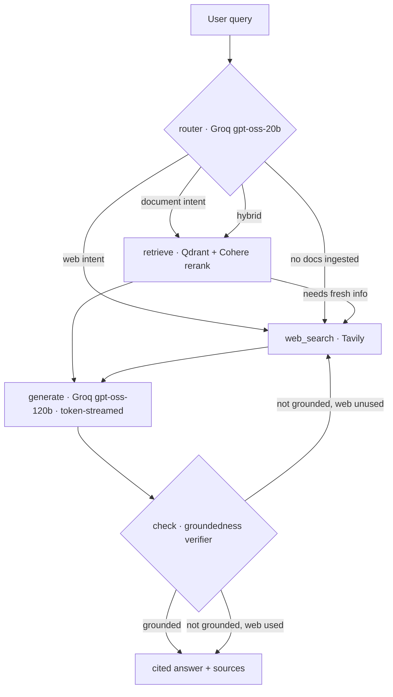

<p align="center">
  
</p>

<p align="center">
  <b>RAGent</b> is a production-grade <b>hybrid Retrieval-Augmented Generation</b> engine wrapped in an
  autonomous <b>LangGraph agent</b>. It answers from <b>your documents</b> and the <b>live web</b> — with
  grounded citations, token streaming, and a self-verification loop that never silently hallucinates.
</p>

<p align="center">
  <a href="#-features">Features</a> ·
  <a href="#-architecture">Architecture</a> ·
  <a href="#-how-it-works">How it works</a> ·
  <a href="#-tech-stack">Tech Stack</a> ·
  <a href="#-getting-started">Getting Started</a> ·
  <a href="#-api-reference">API Reference</a> ·
  <a href="#-roadmap">Roadmap</a>
</p>

<div align="center">


</div>

---

## ✨ Features

| | |
|---|---|
| 🤖 **Autonomous agent** | A 5-node LangGraph workflow — `router → retrieve → web_search → generate → check` — with a built-in self-correction loop. |
| 🔎 **Hybrid retrieval** | Decides intent between **document vectors** (Qdrant) and **live web** (Tavily) — or combines both. |
| 🎯 **Semantic reranking** | **Cohere Rerank v3.5** re-scores every candidate so the LLM only sees the most relevant context. |
| 📚 **Bring your own knowledge** | Drag-and-drop **PDF / TXT / MD** files; they are chunked, embedded, and indexed in seconds. |
| ✅ **Groundedness self-check** | A verifier audits every answer against its sources — and retries via the web when the answer isn't grounded. |
| ⚡ **Token streaming** | Answers stream token-by-token to the UI over **Server-Sent Events** (SSE). |
| 💬 **Persistent conversations** | **MongoDB**-backed sessions and history — with an automatic in-memory fallback. |
| 🖥️ **Polished dark UI** | A zero-dependency **React 18** interface with live phase indicators, cited sources, and a health panel. |

## 🏗 Architecture



## ⚙️ How it works

1. **Route** — a fast Groq model classifies the question as `vector`, `web`, or `hybrid`.
2. **Retrieve** — Qdrant semantic search + Cohere reranking pull the top chunks from *your* knowledge base; Tavily supplies live web results when needed.
3. **Generate** — Groq *gpt-oss-120b* writes the answer strictly from the retrieved context, citing sources inline as `[1]`, `[2]`…
4. **Check** — a verifier re-reads the answer against the sources. If anything is ungrounded (and the web hasn't been tried yet), the graph loops back and retries with fresh results.
5. **Deliver** — the final answer and its cited sources stream to the UI and are persisted to the session history.

## 🧰 Tech Stack

| Layer | Technology |
|---|---|
| Agent runtime | **LangGraph** (StateGraph) |
| LLM | **Groq** — `gpt-oss-120b` (generation) · `gpt-oss-20b` (routing & verification) |
| Embeddings | **Cohere** `embed-english-v3.0` (1024-dim) |
| Reranking | **Cohere** `rerank-v3.5` |
| Vector store | **Qdrant Cloud** (Cosine distance) |
| Web search | **Tavily Search API** |
| Persistence | **MongoDB** |
| API layer | **Express** + Server-Sent Events |
| Frontend | **React 18** · **TypeScript** · **Vite 6** (zero UI deps) |
| Language | TypeScript (strict mode), ES2022 |

---

## 🚀 Getting Started

> **Prerequisites:** Node.js **20+** and npm. All external services are optional at startup — RAGent degrades gracefully (no documents → web-only mode, no MongoDB → in-memory store) — but full functionality needs the matching API keys.

### 1 · Clone

```bash
git clone https://github.com/ashrafumair111-lab/RAG-AI.git
cd RAG-AI
```

### 2 · Configure environment

```bash
cp .env.example .env
# edit .env and paste your API keys
```

### 3 · Run the backend  →  http://localhost:5000

```bash
cd backend
npm install
npm run dev
```

### 4 · Run the frontend  →  http://localhost:5173

```bash
cd ../frontend
npm install
npm run dev
```

Open **http://localhost:5173** — the Vite dev server already proxies `/api/*` and `/health` to the backend. Upload a PDF / TXT / MD file in the sidebar, wait for ingestion, then ask anything.

### Production build

```bash
cd backend && npm run build && npm start      # serves the API
cd frontend && npm run build                  # static site in frontend/dist/
```

## 🔑 Environment Variables

All configuration lives in the project-root **`.env`** file (see [`.env.example`](.env.example)).

| Variable | Required | Description | Default |
|---|---|---|---|
| `PORT` | — | Backend HTTP port | `5000` |
| `GROQ_API_KEY` | ✅ | Groq LLM key (routing + generation) | — |
| `GROQ_API_KEY2` | — | Optional second key (fallback / load-balancing) | — |
| `TAVILY_API_KEY` | ✅ | Live web search | — |
| `COHERE_API_KEY` | ✅ | Embedding + reranking | — |
| `QDRANT_URL` | ✅ | Qdrant Cloud cluster URL | — |
| `QDRANT_API_KEY` | ✅ | Qdrant Cloud API key | — |
| `MONGODB_URL` | — | MongoDB connection string (alias `Mongodb_url` also supported) | `mongodb://localhost:27017` |

## 📡 API Reference

| Method | Endpoint | Description |
|---|---|---|
| `POST` | `/api/chat` | Stream a chat turn — SSE events: `status`, `sources`, `token`, `done`, `error` |
| `POST` | `/api/documents/upload` | Ingest a PDF / TXT / MD file (≤ 15 MB) into the knowledge base |
| `GET` | `/api/documents` | List ingested documents |
| `DELETE` | `/api/documents/:docId` | Delete a document and its vectors |
| `POST` | `/api/sessions` | Create a new chat session |
| `GET` | `/api/sessions` | List recent sessions |
| `GET` | `/api/sessions/:id/messages` | Full message history |
| `DELETE` | `/api/sessions/:id` | Delete a session and its history |
| `GET` | `/health` | Dependency health probe (Groq · Tavily · Cohere · Qdrant · Mongo) |

## 📁 Project Structure

```
.
├── backend/                     # Express + LangGraph agent service
│   └── src/
│       ├── agents/              # StateGraph + nodes (router / retrieve / generate / check)
│       ├── rag/                 # embeddings · retriever · reranker · qdrant · ingest
│       ├── memory/              # MongoDB store (sessions · messages · documents)
│       ├── routes/              # /api/chat · /api/documents · /api/sessions
│       └── config.ts            # central .env configuration
├── frontend/                    # React 18 + Vite chat UI
│   └── src/
│       ├── api/                 # typed client + SSE chat stream parser
│       ├── components/          # Sidebar · MessageList · Composer · EmptyState
│       └── types.ts             # shared API contracts
├── assets/                      # README visuals (animated typewriter banner)
├── .env.example                 # environment template
└── ...
```

## 🗺 Roadmap

- [x] Hybrid retrieval (documents + web) with intent routing
- [x] Groundedness verification & self-correction loop
- [x] PDF / TXT / MD ingestion pipeline
- [x] Token-streaming chat experience
- [ ] Docker Compose one-command deployment
- [ ] LangSmith tracing & observability
- [ ] Hybrid BM25 + semantic search (Qdrant sparse vectors)
- [ ] DOCX / HTML / CSV ingestion
- [ ] Multi-user auth with per-user knowledge bases
- [ ] WebSocket transport + assistant tool calls

## 🤝 Contributing

Contributions are welcome! Please read [CONTRIBUTING.md](CONTRIBUTING.md) first — keep it strict-TypeScript, preserve graceful degradation for missing services, and never commit secrets.

## 🛡 Security

Found a vulnerability? Follow the responsible-disclosure notes in [SECURITY.md](SECURITY.md). Never paste real API keys into issues or PRs — use the `.env.example` template.

## 📄 License

Distributed under the **MIT License**. See [LICENSE](LICENSE).

## 🙏 Acknowledgements

Built with **LangGraph**, **LangChain**, **Groq**, **Cohere**, **Qdrant**, **Tavily**, **MongoDB**, and **Vite** — plus a loyal fleet of coffee machines. ☕
